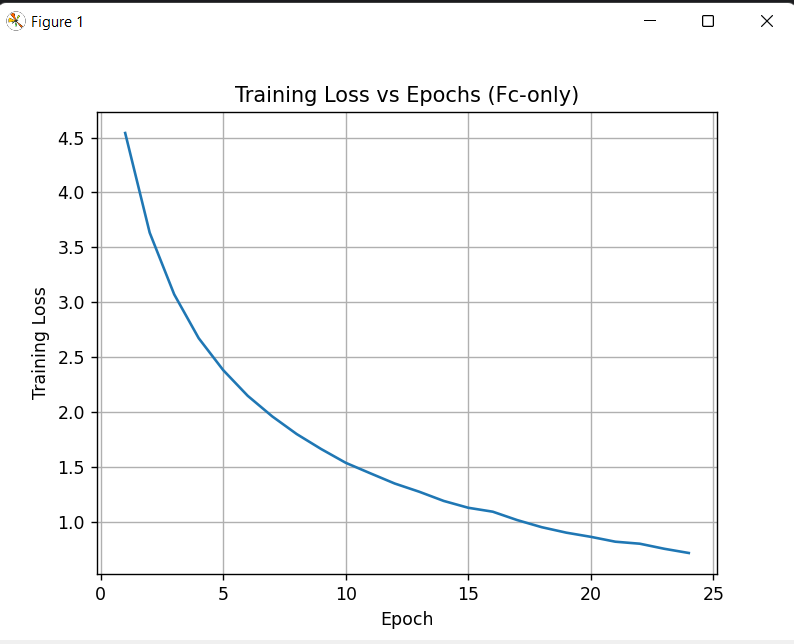
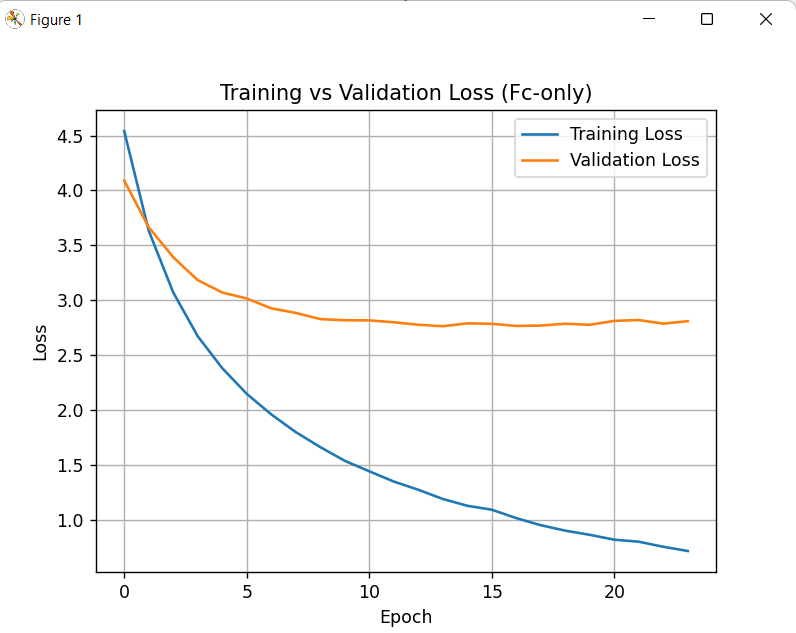
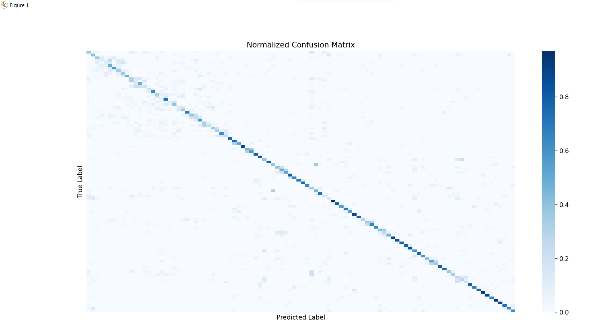
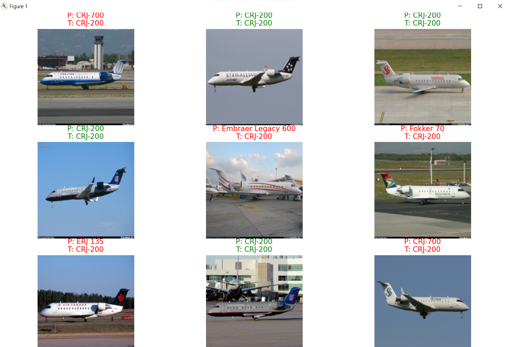

# Aircraft Classification via Transfer Learning (ResNet18)

**Fine-grained image classification system developed during a 5-month Validation & Testing (ML) internship — 100-class aircraft identification using progressive transfer learning.**

This project moved from a baseline transfer-learning classifier to a deliberately fine-tuned model, with the comparison itself treated as the experiment — not just the end accuracy number.

---

## System Architecture

The system is split into two independent pipelines that only share a model definition — a deliberate separation, not an accident (see Challenges).

```
FGVC Aircraft Dataset (100 classes)
        │
        ▼
Preprocessing: Resize(224×224) → Tensor → ImageNet Normalize
        │
        ▼
   train.py                              test.py
   ────────                              ───────
   Pretrained ResNet18                   Rebuild ResNet18 architecture
   (backbone frozen)                     Load saved state_dict (weights only)
        │                                       │
   Replace FC layer:                     Run inference on validation/test set
   nn.Linear(features, 100)                     │
        │                                Generate: accuracy, confusion matrix,
   Train loop:                             correct/incorrect prediction samples
   forward → CrossEntropyLoss
   → backward (autograd) → Adam step
        │
   Per-epoch validation loss
        │
   Early stopping (patience=10)
   → checkpoint best model
```

**Two training strategies were run as a controlled comparison, not as a single fixed pipeline:**

| Strategy | Trainable params | Best validation loss | Test accuracy |
|---|---|---|---|
| FC-only fine-tuning | Final classification layer only | ≈ 2.76 | 52.81% |
| Layer4 + FC fine-tuning | Final conv block + classification layer | ≈ 1.89 | — (see note) |

*Note: the 52.81% figure is the measured test accuracy for the FC-only model. The Layer4+FC model's accuracy wasn't captured in these notes but its lower validation loss (1.89 vs 2.76) indicates it outperformed FC-only — consistent with the architecture change being driven by a diagnosed capacity limitation, not a hyperparameter tweak.*

**Dataset split (FGVC Aircraft):** 3,334 training samples / 3,333 validation samples, 100 classes, batch size 32, learning rate 1e-3 (Adam), trained/evaluated on CUDA GPU.

The architecture decision (what to freeze vs. unfreeze) was treated as a tunable experimental variable, with loss curves and confusion matrices used as evidence to justify the final choice — not just adopting deeper fine-tuning by default.

## Compute & Stack (Hardware/Environment Reality)

No physical hardware in this project — the equivalent constraint here is compute and environment, which shaped the design as concretely as a BOM does in a hardware project.

| Component | Role | Notes |
|---|---|---|
| PyTorch + torchvision | Core framework | Dataset loading, model, training loop |
| Pretrained ResNet18 (ImageNet weights) | Backbone | Transfer learning base, not trained from scratch |
| FGVC Aircraft dataset | Data | 100 classes, thousands of labeled images |
| GPU training environment | Compute | Required for feasible training times at 100-epoch scale |
| `train.py` / `test.py` | Pipeline split | Independent scripts sharing only the model definition |
| Cross Entropy Loss + Adam optimizer | Training config | Standard classification setup |
| Checkpointing system | Model persistence | Saves best-validation-loss model state_dict |

**Preprocessing pipeline:** all images resized to 224×224 to match ResNet18's expected input, converted to tensors, and normalized using ImageNet statistics (mean `[0.485, 0.456, 0.406]`, std `[0.229, 0.224, 0.225]`) — matching the distribution the pretrained backbone was originally trained on, which materially improved convergence.

---

## Challenges & Debugging

**1. Architecture vs. weights confusion (early conceptual gap)**
Initially unclear why the testing script had to reconstruct the full ResNet18 architecture before loading saved weights, rather than just loading a "trained model" directly.
- **Resolution:** Identified that a `state_dict` stores only parameter values, not architecture — so the exact model structure must be instantiated first, then weights loaded into it. This is now correctly reflected in the train/test pipeline split.

**2. FC-only fine-tuning underperforming**
Training only the final fully connected layer led to validation loss plateauing early, with limited improvement regardless of epoch count.
- **Debugging approach:** Compared loss curves between configurations rather than assuming more epochs would fix it. Diagnosed the issue as a capacity/representation problem, not an optimization problem.
- **Fix:** Unfroze `layer4` (final conv block) in addition to FC, allowing deeper feature representations to adapt to aircraft-specific features rather than generic ImageNet features. Validation loss dropped from ≈2.76 to ≈1.89.

**3. Long training runs and a hard interruption**
Scaling epochs from 5 → 100 led to long sessions, and one training run was lost mid-way when the machine shut down unexpectedly — a real-world reliability failure, not a code bug.
- **Fix:** Implemented early stopping (patience = 10 non-improving validation epochs) combined with best-model checkpointing on every validation improvement. This made training resilient to interruption and eliminated wasted compute on runs that had already converged.

**4. Plotting/debugging errors during result analysis**
Hit a `NameError` from referencing `num_epochs` instead of the actual variable `EPOCHS`, and a dimension mismatch (`x and y must have same dimension`) when loss arrays weren't loaded correctly from disk.
- **Fix:** Traced both back to inconsistent variable naming and incomplete loss-file loading logic; corrected variable references and validated array lengths before plotting.

**5. Monolithic script becoming unmanageable**
All logic initially lived in a single script, making it hard to iterate on training without re-running or duplicating testing logic (and vice versa).
- **Fix:** Split into `train.py` and `test.py` with a shared model definition — a deliberate move toward the train/test separation used in real ML engineering workflows, not just code cleanup.

---

## Resourcefulness & AI Integration

This was a 5-month internship project where the core engineering judgment was mine — what to compare, what to diagnose, and what counted as sufficient evidence before changing the architecture — while tooling and reference material (PyTorch documentation, online ML resources, AI-assisted boilerplate for things like DataLoader setup and plotting scaffolding) were used deliberately to avoid reinventing well-established patterns.

The actual engineering work was in the experimental design and debugging: deciding to run FC-only vs. Layer4+FC as a controlled comparison rather than picking one approach, diagnosing *why* FC-only plateaued (a representational capacity question, not a hyperparameter one), and building resilience into the training process after losing a run to a hardware interruption. That's the same systems-level judgment this portfolio is meant to demonstrate — just applied to a software/ML pipeline instead of physical wiring.

---

## Results Summary

- **FC-only fine-tuning overfit visibly.** The training-vs-validation loss curve shows training loss continuing to drop smoothly to ≈0.7 by epoch 24, while validation loss plateaued around 2.8 by epoch ~8 and stayed flat (even ticking up slightly) for the remainder of training. This is the clearest evidence in the project that the frozen backbone had hit its representational ceiling — the model was memorizing training examples rather than learning more about aircraft features, which directly motivated unfreezing `layer4`.

| Training Loss (FC-only) | Training vs Validation Loss (FC-only) |
|---|---|
|  |  | 

*Left: training loss drops steadily across 24 epochs. Right: validation loss stops improving by epoch ~8 while training loss continues falling — a textbook overfitting signature that diagnosed the need for deeper fine-tuning.*
- **Layer4 + FC fine-tuning outperformed FC-only fine-tuning** on validation loss (1.89 vs. 2.76), confirming that deeper feature adaptation — not just more training time on a frozen backbone — was the actual bottleneck.
- **Test accuracy (FC-only model): 52.81%** on 3,333 held-out validation images across 100 fine-grained classes — a reasonable baseline for a frozen-backbone approach on a fine-grained dataset where many classes are visually close variants of each other.
- **Confusion matrix analysis** showed strong diagonal dominance with most aircraft classes correctly identified; remaining misclassifications clustered among visually similar aircraft models. The qualitative prediction grid makes this concrete: most FC-only misclassifications were regional jets confused for other regional jets (e.g. CRJ-200 predicted as CRJ-700, Embraer Legacy 600, Fokker 70, or ERJ135) — confirming the model had learned a "regional jet" feature region without enough resolution to separate visually similar sub-variants. This is consistent with the overfitting/capacity diagnosis above, and is exactly the kind of failure mode Layer4+FC fine-tuning was designed to address.

**Normalized Confusion Matrix (100 classes, FC-only model):**



*Strong diagonal dominance confirms the model learned per-class structure. Off-diagonal errors concentrate among visually similar aircraft families.*

**Sample Predictions (green = correct, red = incorrect):**



*Misclassified examples are predominantly within the same aircraft family (e.g. CRJ variants, regional jets) — the model fails at fine-grained sub-variant discrimination, not at gross category recognition.*

---

## Representative Code

**Transfer learning setup — freeze backbone, replace classifier head:**
```python
model = models.resnet18(weights="IMAGENET1K_V1")

# Freeze all layers
for param in model.parameters():
    param.requires_grad = False

# Replace final layer to match 100 aircraft classes
num_features = model.fc.in_features
model.fc = nn.Linear(num_features, 100)

# Only fc parameters are trainable in this configuration
for param in model.fc.parameters():
    param.requires_grad = True
```

**Early stopping with best-model checkpointing:**
```python
if val_loss < best_val_loss:
    best_val_loss = val_loss
    patience_counter = 0
    torch.save(model.state_dict(), "best_model_fc.pth")
else:
    patience_counter += 1

if patience_counter >= patience:
    print("Early stopping triggered.")
    break
```

**Test pipeline — architecture rebuilt independently from training script:**
```python
model = models.resnet18(weights=None)  # no pretrained weights — only the trained state_dict matters here
num_features = model.fc.in_features
model.fc = nn.Linear(num_features, 100)
model.load_state_dict(torch.load("best_model_fc.pth", map_location=device))
model.eval()
```

---

## Roadmap / Future Improvements

- **Data augmentation:** random flips, rotations, color jitter, random crops to improve generalization.
- **Deeper fine-tuning:** experiment with `layer3 + layer4 + fc` or full-network fine-tuning.
- **Learning rate scheduling:** `ReduceLROnPlateau` or `StepLR` instead of a fixed rate.
- **Architecture comparison:** benchmark ResNet18 against ResNet50, EfficientNet, DenseNet, and Vision Transformers (ViT).
- **Top-5 accuracy:** standard metric for fine-grained classification tasks, not currently measured.
- **Deployment:** wrap the trained model in a desktop, web, or mobile interface for end-user aircraft image classification.
